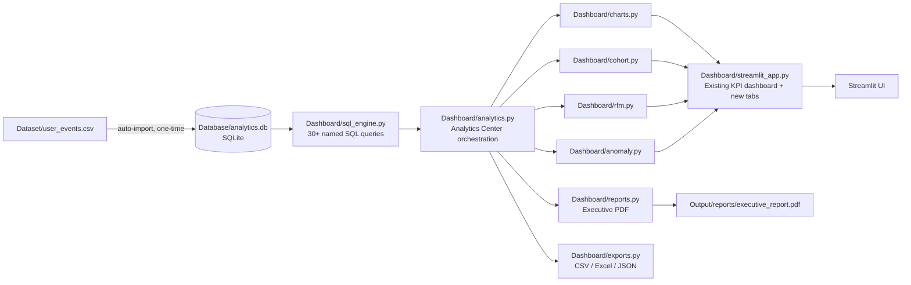

# 📊 Product Analytics & Monetization Dashboard

[[Python](https://img.shields.io/badge/Python-3.10%2B-blue.svg)](https://www.python.org/)
[[SQL](https://img.shields.io/badge/SQL-Advanced-orange.svg)](https://www.mysql.com/)
[[Power BI](https://img.shields.io/badge/Power_BI-Interactive-yellow.svg)](https://powerbi.microsoft.com/)
[[Status](https://img.shields.io/badge/Status-Production_Ready-success.svg)]()

A comprehensive, production-quality portfolio project demonstrating end-to-end product analytics, user behavior modeling, revenue optimization, and interactive dashboard design. Modeled after analytics practices at high-growth tech and fintech companies (Swiggy, Zomato, Razorpay, PhonePe).

---

## 🚀 Project Overview
This project analyzes **300,000+ user event records** across 10,000+ unique users over a 180-day period. It answers critical product questions regarding user acquisition, engagement funnels, retention cohorts, monetization drivers, and churn risk.

---

## 🛠️ Tech Stack
- **Dataset Generation**: Python, Pandas, NumPy, Faker
- **Database & Querying**: MySQL / PostgreSQL (CTEs, Window Functions, Aggregations)
- **Exploratory Data Analysis**: Jupyter Notebook, Pandas, Seaborn, Matplotlib
- **Business Intelligence**: Power BI (DAX measures, interactive slicers, KPI cards)

---

## 📈 Key Metrics Tracked (KPIs)
- **DAU, WAU, MAU**: Daily, Weekly, and Monthly Active Users
- **ARPU & ARPPU**: Average Revenue Per User & Average Revenue Per Paying User
- **Retention Rate**: Day-1, Day-7, Day-30, and Cohort Retention Matrices
- **Conversion Funnel**: Step-by-step conversion from App Open to Purchase
- **Churn Rate**: Subscription and user-level churn tracking

---

## 📂 Repository Structure
- `Dataset/`: Synthetic data generation script and CSV output.
- `SQL/`: Database schema, bulk import scripts, and advanced analytical queries.
- `Python/`: EDA, cleaning, and statistical modeling scripts.
- `PowerBI/`: Dashboard blueprint, measures, and visual specifications.
- `Business Insights/`: 20+ actionable business recommendations.
- `Resume Description.txt`: ATS-optimized resume bullets and interview talking points.

---

# 🧠 Platform Extension — Product Analytics Platform v2

*(The sections below document the additive Portfolio Platform layer built on top of the original dashboard described above. Nothing in the original project was removed — this extends it into an internal-analytics-platform-style deliverable.)*

## 🏗️ Architecture Diagram



## 🔄 Project Workflow

1. **Ingest** — `Dashboard/database.py` auto-imports `Dataset/user_events.csv` into `Database/analytics.db` the first time it's missing (idempotent; safe to re-run).
2. **Query** — `sql_engine.py` exposes 30+ pure-SQL analytics functions (DAU/WAU/MAU, revenue breakdowns, funnels, retention, growth rates, Top-N, etc.), each accepting the same filter shape as the dashboard sidebar.
3. **Analyze** — `cohort.py`, `rfm.py`, and `anomaly.py` layer cohort retention, RFM segmentation, and statistical anomaly detection on top of the SQL layer.
4. **Visualize** — `charts.py` and `kpis.py` render Plotly figures and themed KPI cards; `analytics.py` assembles them into tabs inside the existing Streamlit app.
5. **Report & Export** — `reports.py` renders a polished executive PDF; `exports.py` produces CSV / multi-sheet Excel / JSON bundles on demand.

## 📁 Updated Folder Structure

```
Product-Analytics-Dashboard/
├── Database/
│   └── analytics.db                # auto-generated SQLite database
├── Dashboard/
│   ├── streamlit_app.py            # original dashboard (unchanged, now calls analytics.py)
│   ├── database.py                 # SQLite connection + CSV auto-import
│   ├── sql_engine.py                # 30+ SQL analytics queries
│   ├── cohort.py                   # cohort retention analysis
│   ├── rfm.py                      # RFM customer segmentation
│   ├── anomaly.py                  # statistical anomaly detection
│   ├── charts.py                   # Plotly chart builders
│   ├── kpis.py                     # KPI card rendering helpers
│   ├── filters.py                  # UI filter -> SQL filter adapter
│   ├── analytics.py                # Analytics Center orchestration (new tabs)
│   ├── reports.py                  # Executive PDF report generator
│   ├── exports.py                  # CSV / Excel / JSON export helpers
│   ├── styles.py                   # shared theme constants
│   └── utils.py                    # logging, formatting helpers
├── Dataset/
├── SQL/                             # original MySQL/PostgreSQL reference queries (unchanged)
├── Python/
├── PowerBI/
├── Business_Insights/
└── Output/
    └── reports/
        └── executive_report.pdf    # generated on demand from the Reports tab
```

## 🧰 Technology Stack (Additions)

| Layer | Technology |
|---|---|
| Embedded analytics database | SQLite (via `sqlite3` + pandas) |
| SQL analytics layer | Parameterized SQL, CTEs, window-style aggregations |
| Cohort / RFM / Anomaly | Pandas, NumPy (z-score outlier detection) |
| PDF reporting | ReportLab + Matplotlib (chart rasterization) |
| Excel export | XlsxWriter |
| Dashboard framework | Streamlit + Plotly (unchanged from original) |

## ✅ New Features

- SQLite-backed analytics database, auto-built from the CSV on first run
- 30+ reusable SQL analytics functions (DAU/WAU/MAU, revenue, funnel, retention, growth, Top-N, and more)
- Analytics Center tab: growth %, country/device/subscription/traffic-source comparisons, Top-10 breakdowns
- Interactive Day 1/3/7/14/30 cohort retention heatmap
- RFM segmentation into 6 lifecycle segments with a treemap, summary table, and recommendations
- Automated anomaly detection (revenue, traffic, campaign, retention) surfaced as warning cards
- One-click executive PDF report (KPIs, charts, insights, recommendations, tables)
- CSV / Excel (multi-sheet) / JSON / PDF exports of the current filtered view

## 💻 Installation Guide

```bash
cd Product-Analytics-Dashboard
pip install -r Python/requirements.txt

# (Optional) pre-build the SQLite database — the app will also do this
# automatically on first run:
python Dashboard/database.py
```

## 🚀 Running the Dashboard

```bash
streamlit run Dashboard/streamlit_app.py
```

## 📦 Deployment Guide

- **Streamlit Community Cloud**: point the app at `Dashboard/streamlit_app.py`; the SQLite database and PDF report are generated at runtime, so no extra build step is required beyond installing `Python/requirements.txt`.
- **Docker**: base on `python:3.11-slim`, `pip install -r Python/requirements.txt`, `EXPOSE 8501`, `CMD ["streamlit", "run", "Dashboard/streamlit_app.py", "--server.address=0.0.0.0"]`.
- **Persisting the database**: mount `Database/` as a volume if you want the SQLite import to survive container restarts instead of rebuilding from CSV each time.

## 🖼️ Dashboard Screenshots

*(Add screenshots of the Analytics Center, Cohort Heatmap, RFM Treemap, and Anomaly Detection tabs here after your first local run — e.g. `Output/figures/analytics_center.png`.)*

## 💡 Business Insights

See `Business_Insights/insights.md` for narrative insights, and the in-app **Reports & Exports** tab for a live, filter-aware executive PDF summary.

## 🔮 Future Improvements

- Swap SQLite for a managed warehouse (BigQuery/Snowflake) behind the same `sql_engine.py` interface for production scale
- Add scheduled anomaly-detection alerts (Slack/email) instead of in-app cards only
- Extend RFM with a predictive churn model (e.g. gradient boosting on recency/frequency/monetary + engagement features)
- Add user-level drill-down views linked from the cohort and RFM tables

---
